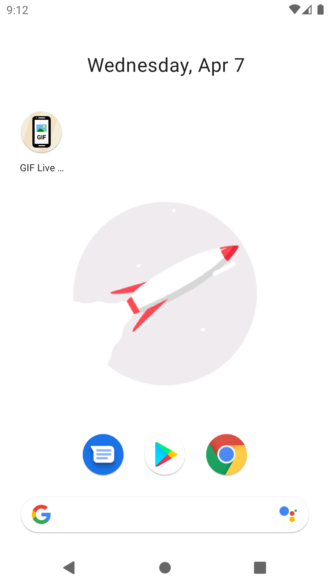

   

# gif-wallpaper

Playing with GIFs, animatable and drawable

## Inspiration

This app was created because I wanted to display as a wallpaper the animated ninja turtles of
Alex Redfish. [Check their art](https://www.artstation.com/artwork/5wm5W), it's dope.

## Other cool gifs

- [JN3008](https://jn3008.tumblr.com/)
- [Mad Max](https://www.behance.net/gallery/26428843/MAD-MAX-Fury-Road)
- [SeerLight 🌙✨](https://twitter.com/seerlight)
- [SlimJim](http://www.slimjimstudios.com/#/la-gifathon/)
- [Waneella](https://twitter.com/waneella_/)

## Contributors

- [Poussinou](https://github.com/Poussinou) - F-Droid and Google Play Store links
- Mister klaid - Russian translations
- [YesIanYeha](https://github.com/Preyesianyeha) - Spanish translations

## Translations

You want to help with translations? You find your language missing and want to help?
That is awesome!
I use the website **POEditor** to handle translations. They are free for open source project and easy to use, and provide synchronisation with Github. So follow [this link to join the translations project](https://poeditor.com/join/project?hash=QaDkuFZTp2).

## Example

#### Actual GIF

#### Set as Wallpaper

